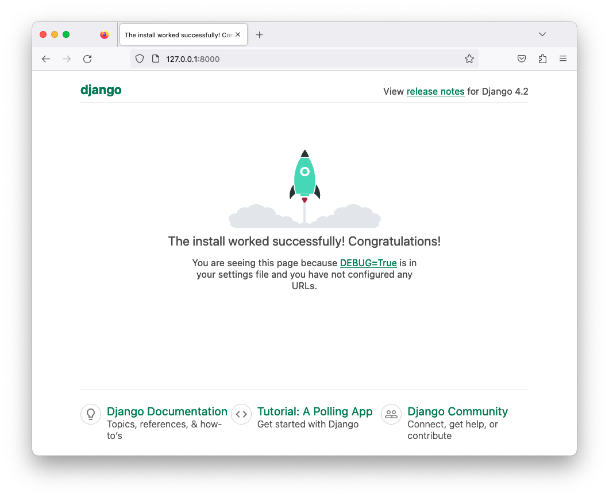

# Создание Django Проекта

**Оглавление:**
- [Создание Django Проекта](#создание-django-проекта)
  - [1. Создание проекта](#1-создание-проекта)
    - [1.1. Подготовка виртуального окружения](#11-подготовка-виртуального-окружения)
    - [1.2. Знакомство с django-admin](#12-знакомство-с-django-admin)
    - [1.3. Создание нового проекта](#13-создание-нового-проекта)
  - [2. Тестовый запуск веб-приложения](#2-тестовый-запуск-веб-приложения)


## 1. Создание проекта 
 
### 1.1. Подготовка виртуального окружения

* Создаем виртуальное окружение Python в текущем рабочем каталоге с именем "venv". 
* Активируем виртуальное окружение. 
* Обновляет установленную версию pip до последней версии. 
* Выводим список всех установленных пакетов Python в текущем виртуальном окружении.

```sh
python -m venv venv
source venv/bin/activate
pip install --upgrade pip 
pip list
```
```
Package    Version
---------- -------
pip        23.1.2
setuptools 65.5.0
```

---

* Добавляем строку `django` в файл "requirements.txt"
* Устанавливаем все зависимости, перечисленные в файле "requirements.txt". 

```sh 
echo django >> requirements.txt
pip install -r requirements.txt
pip list
```

```
pip list
Package    Version
---------- -------
asgiref    3.6.0
Django     4.2
pip        23.1.2
setuptools 65.5.0
sqlparse   0.4.4
```

---

Cтруктура каталогов проекта **Django**. Краткое описание каждого элемента:

* **venv/** - Виртуальное окружение Python. Содержит все установленные зависимости, которые нужны для запуска проекта.
* **README.md** - Содержит описание проекта.
* **requirements.txt** - Файл, содержащий список всех зависимостей проекта.

```python
LAB-01/
├── venv/
│   ├── bin/
│   ├── include/
│   ├── lib/
│   └── pyvenv.cfg
│
├── README.md
└── requirements.txt
```


### 1.2. Знакомство с django-admin

* **django-admin** - это утилита командной строки, предоставляемая Django, которая позволяет выполнять различные задачи, такие как:
  - создание приложений,
  - миграция базы данных, 
  - управление пользователями и группами 
  - и многое другое.

```sh
django-admin help
```
```
Type 'django-admin help <subcommand>' for help on a specific subcommand.

Available subcommands:

[django]
    check            - Проверка проекта на ошибки.
    compilemessages  - Компиляция файлов перевода (.po) в двоичный формат (.mo).
    createcachetable - Создание таблицы для кэширования.
    dbshell          - Вход в интерактивный интерфейс CLI для работы с DB.
    diffsettings     - Вывод различий между настройками проекта и значениями по умолчанию.
    dumpdata         - Экспорт данных из базы данных в файл в формате JSON или XML.
    flush            - Очистка содержимого базы данных.
    inspectdb        - Создание моделей на основе существующей базы данных.
    loaddata         - Импорт данных из файла в формате JSON или XML в базу данных.
    makemessages     - Создание файлов перевода (.po) на основе строк в коде.
    makemigrations   - Создание файла миграции на основе изменений в моделях.
    migrate          - Применение миграций к базе данных.
    optimizemigration - Оптимизация файлов миграции.
    runserver        - Запуск веб-сервера.
    sendtestemail    - Отправка тестового письма на заданный адрес электронной почты.
    shell            - Запуск интерактивной оболочки Django.
    showmigrations   - Вывод списка миграций и их статусов.
    sqlflush         - Вывод SQL-запросов для очистки содержимого базы данных.
    sqlmigrate       - Вывод SQL-запросов для миграции базы данных на определенную миграцию.
    sqlsequencereset - Вывод SQL-запросов для сброса последовательностей базы данных.
    squashmigrations - Слияние нескольких миграций в одну.
    startapp         - Создание нового Django-приложения.
    startproject     - Создание нового Django-проекта.
    test             - Запуск тестов для проекта.
    testserver       - Запуск веб-сервера с тестовыми данными.
```

* Команда выводит версию Django:
```sh
django-admin version
```
```
4.2
```


### 1.3. Создание нового проекта

* Создаем новый Django-проект с именем **PrjContacts** (*Проект Контакты*).
* Django-проект - это набор настроек и приложений, необходимых для создания веб-приложения. 
* Команда `startproject` создает структуру каталогов проекта и набор файлов конфигурации Django, таких как `settings.py`, `urls.py` и `wsgi.py`.

```sh
django-admin startproject PrjContacts
```

* В результате выполнения команды структура каталогов должна выглядеть примерно так:

```python
LAB-01/
├── PrjContacts/          # New: Корневой каталог
│   ├── PrjContacts/      # New: Подкаталог содержит
│   │   ├── __init__.py   # New: Определяем каталог как Python пакет
│   │   ├── asgi.py       # New: Asynchronous Server Gateway Interface
│   │   ├── settings.py   # New: Файл настроек Django-проекта
│   │   ├── urls.py       # New: Файл маршрутизации URL-адресов
│   │   └── wsgi.py       # New: Web Server Gateway Interface
│   │   
│   └── manage.py         # New: файл управления проектом Django
│
├── venv/
│   ├── bin/
│   ├── include/
│   ├── lib/
│   └── pyvenv.cfg
│
├── README.md
└── requirements.txt
```
* Файл `manage.py` - это файл управления **Django**, который используется для запуска различных команд, связанных с проектом. Например, с помощью `manage.py runserver` можно запустить локальный веб-сервер для разработки и отладки приложения.

---

**Notes:**
1. После создания проекта, мы вместо **django-admin <subcommands>** будем использовать **python manage.py <subcommands>**
   - `django-admin <subcommands>` 
   - `python manage.py <subcommands>`
2. Так как в файле **manage.py** присутствует строка `#!/usr/bin/env python` -- это позволяет запускать скрипт без указания **python**:
   - `python manage.py <subcommands>`
   - `./manage.py <subcommands>`

--- 

```sh
cd PrjContacts/ 
./manage.py --help
```
```
Type 'manage.py help <subcommand>' for help on a specific subcommand.

Available subcommands:

[auth]          # содержит подкоманды, связанные с аутентификацией, 
  ...           # такие как "changepassword" и "createsuperuser".

[contenttypes]  # содержит подкоманду "remove_stale_contenttypes", 
  ...           # которая удаляет старые типы содержимого.

[django]        # содержит множество подкоманд, связанных с управлением проектом Django, 
  ...           # таких как makemigrations, migrate, test и т.д.

[sessions]      # содержит подкоманду "clearsessions", 
  ...           # которая очищает сессии в базе данных.

[staticfiles]   # содержит подкоманды, связанные со статическими файлами, 
  ...           # такие как "collectstatic", "findstatic" и "runserver".

```


## 2. Тестовый запуск веб-приложения

```sh
./manage.py runserver
```
```log
Watching for file changes with StatReloader
Performing system checks...

System check identified no issues (0 silenced).

You have 18 unapplied migration(s). Your project may not work properly until you apply the migrations for app(s): admin, auth, contenttypes, sessions.
Run 'python manage.py migrate' to apply them.
May 04, 2023 - 12:52:46
Django version 4.2.1, using settings 'PrjContacts.settings'

Starting development server at http://127.0.0.1:8000/
Quit the server with CONTROL-C.
```

